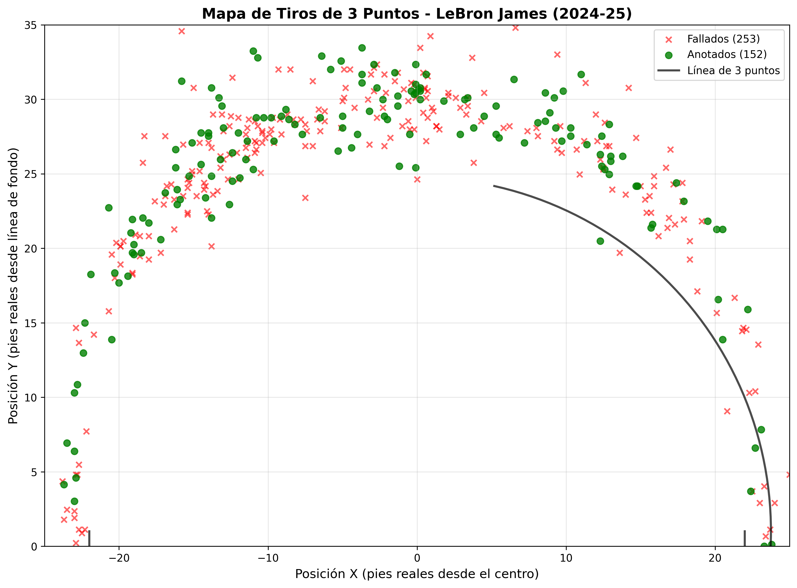
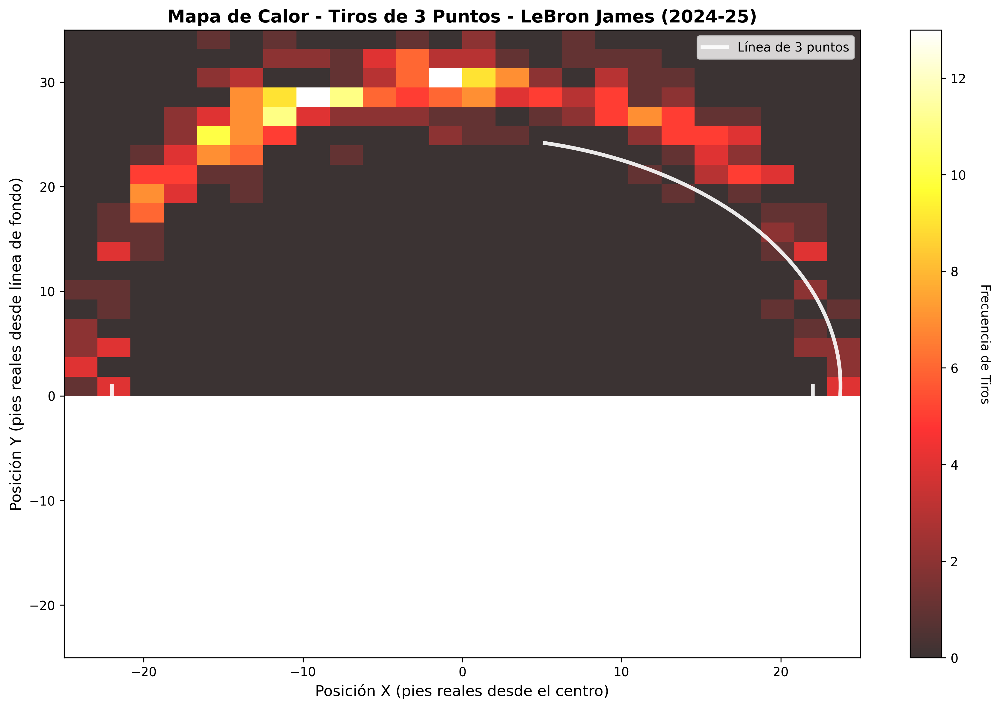

# 🏀 NBA Analytics System

Sistema de análisis de tiros de 3 puntos de la NBA con funcionalidad online y offline.

## 📁 Estructura del Proyecto

```
mlNBA/
├── main.py                    # 🎯 SCRIPT PRINCIPAL - Análisis completo
├── download_all_shots.py      # 📥 Descarga completa de todos los jugadores
├── test_download.py           # 🧪 Descarga de prueba (10 jugadores)
├── nba_offline_loader.py      # 📁 Cargador de datos offline
├── all_shots_3pt_*.csv       # 💾 Datos descargados
└── *.png                     # 📊 Gráficos generados
```

## 🚀 Uso del Sistema

### 1. Script Principal
```bash
uv run python main.py
```
- ✅ **Funciona online y offline automáticamente**
- 📊 Análisis completo de tiros de 3 puntos
- 📍 Mapas de tiros con coordenadas reales
- 🔥 Mapas de calor de frecuencia
- 🏀 Análisis de últimos 20 juegos de Dallas Mavericks

### 2. Descarga de Datos (Opcional)

#### Prueba Rápida (5-10 minutos)
```bash
uv run python test_download.py
```
- 👥 Descarga 10 jugadores populares
- 🧪 Perfecto para pruebas
- ⚡ Rápido y eficiente

#### Descarga Completa (3-4 horas)
```bash
uv run python download_all_shots.py
```
- 👥 Descarga ~500 jugadores activos
- 📊 ~90,000+ tiros de 3 puntos
- 💾 Base de datos completa offline

## 🌐 Modos de Funcionamiento

### Modo Online (Automático)
- Conecta directamente a la NBA API
- Requiere conexión a internet
- Descarga datos en tiempo real

### Modo Offline (Automático)
- Usa datos previamente descargados
- No requiere internet
- Análisis instantáneo

El sistema **detecta automáticamente** qué modo usar.

## 📊 Funcionalidades

### 🎯 Análisis por Jugador
- **Estadísticas por zonas**: Corner 3s, Above the Break, etc.
- **Mapas de tiros**: Ubicación exacta de cada tiro
- **Mapas de calor**: Frecuencia de tiros por zona
- **Coordenadas reales**: Conversión a pies de la cancha NBA

### 🏀 Análisis de Equipos
- Últimos 20 juegos de Dallas Mavericks
- Victorias, derrotas, promedios
- Record de temporada

### 📐 Sistema de Coordenadas
- ✅ Conversión API → Distancias reales en pies
- ✅ Línea de 3 puntos geométricamente correcta
- ✅ Coordenadas X,Y convertidas a pies reales

## 🔧 Configuración

### Requisitos
```bash
# Ya configurado en pyproject.toml
uv sync
```

### Dependencias Principales
- `nba_api`: Acceso a datos de la NBA
- `pandas`: Manipulación de datos
- `matplotlib`: Visualización
- `numpy`: Cálculos numéricos

## 🎨 Ejemplos de Salida

### Mapas de Tiros


### Mapas de Calor


### Estadísticas por Zona
```
           Zone  3PM  3PA   3P%
0  Above the Break 3   45   89  50.6
1     Left Corner 3    8   16  50.0
2    Right Corner 3   12   23  52.2
```

## 🎯 Personalización

Para analizar otro jugador, edita `main.py`:
```python
# Cambiar estas líneas en main():
player3PTS(2544, ultima_temporada, "LeBron James")
shot_chart_map(2544, ultima_temporada, "LeBron James")
shot_heatmap(2544, ultima_temporada, "LeBron James")

# Por ejemplo, para Stephen Curry:
player3PTS(201939, ultima_temporada, "Stephen Curry")
shot_chart_map(201939, ultima_temporada, "Stephen Curry")
shot_heatmap(201939, ultima_temporada, "Stephen Curry")
```

## 📈 Características Técnicas

- **Rate Limiting**: Respeta límites de la NBA API
- **Error Handling**: Manejo robusto de errores
- **Auto-Detection**: Detección automática de GUI/no-GUI
- **Coordinate Conversion**: Conversión precisa de coordenadas
- **Data Validation**: Validación de datos de entrada

## 🔍 Troubleshooting

### Si no funciona en modo online:
1. Verificar conexión a internet
2. La NBA API puede estar temporalmente no disponible
3. Usar datos offline con `test_download.py` o `download_all_shots.py`

### Si las imágenes no se muestran:
- Las imágenes se guardan como archivos PNG
- En VS Code se intentan abrir automáticamente
- Revisar los archivos `*.png` generados

## 🏆 Ejemplos de Jugadores Disponibles (Modo Offline)

Si has ejecutado la descarga, estos jugadores están disponibles:
- LeBron James (2544)
- Stephen Curry (201939)
- Luka Dončić (1629029)
- James Harden (201935)
- Damian Lillard (203081)
- Y muchos más...

## 📞 Soporte

Para modificar o extender el sistema:
1. Revisar `main.py` para funciones principales
2. Revisar `nba_offline_loader.py` para manejo de datos offline
3. Todos los scripts tienen documentación integrada
